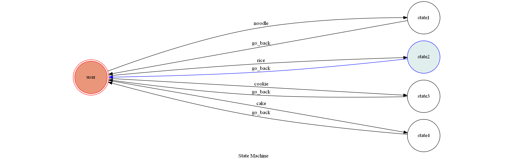

# TOC Project 2017
## cook_bot
You can choose : noodle, rice, cookie, cake,
and you will get a recipe.
## Setup

### Prerequisite
* Python 3.4

#### Install Dependency
```sh
pip install -r requirements.txt
```

* pygraphviz (For visualizing Finite State Machine)
    * [Setup pygraphviz on Ubuntu](http://www.jianshu.com/p/a3da7ecc5303)

### Secret Data

`API_TOKEN` and `WEBHOOK_URL` in app.py **MUST** be set to proper values.
Otherwise, you might not be able to run your code.

### Run Locally
You can either setup https server or using `ngrok` as a proxy.

**`ngrok` would be used in the following instruction**

```sh
ngrok http 5000
```

After that, `ngrok` would generate a https URL.

You should set `WEBHOOK_URL` (in app.py) to `your-https-URL/hook`.

#### Run the sever

```sh
python3 app.py
```

## Finite State Machine


## Usage
The initial state is set to `user`.

Every time `user` state is triggered to `what you want to eat` to another state, it will `go_back` to `user` state after the bot replies  a recipe.

* user
	* Input: "noodle"
		* Reply: "choose noodle"

	* Input: "rice"
		* Reply: "choose rice"
    
	* Input: "cookie"
		* Reply: "choose cookie"
    
	* Input: "cake"
		* Reply: "choose cake"

